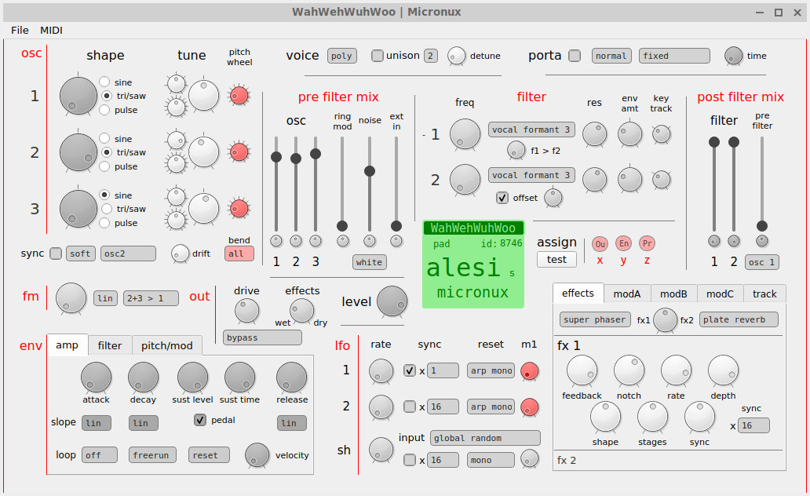

# Micronux

**Micronux** will be a graphical editor for Linux to edit programs from the Alesis Micron synthesiser.  
It is just meant as a front end to edit for the text files generated by Alesis' program decoder/encoder perl script, and doesn't work in real time (but eventually should get really close).

### Work in progress

Micronux is in early days development and doesn't do anything useful right now. For something that actually works on GNU/Linux, see the simple (yet smart) perl script by ralphgonz [here](https://sites.google.com/site/ralphgonz/music-micron).

### [To Do List](docs/TODO.md)

### Usage

You'll need Python, PySide2 and make the script executable

    pip install PySide2
    chmod +x micronux.py
    python micronux.py

You can replace `pip` and `python` by `pip3` and `python3` if you feel so inclined.  
So far *Micronux* only reads the test.txt file (as produced by Alesis' program decoder) and display most of it's values.

### About

*Micronux* is written in **python** and uses the **PySide2** bindings for its **QT** graphical interface, which is built using **QT Designer**. It will use **amidi** to send/receive sysex programs through midi.

The user interface is inspired by the physical layout of the Ion synthesiser as well as existing Mac/Windows editors. Since the amount of controls and settings of the Micron can be overwhelming, the goal is to simplify and promote the more commonly used settings.

Additionally, one goal is to keep Micronux functional on a netbook screen, so limited to a size of 1024x600 pixels. The use of tabs and pop-up windows should eventually give access to all the settings.

