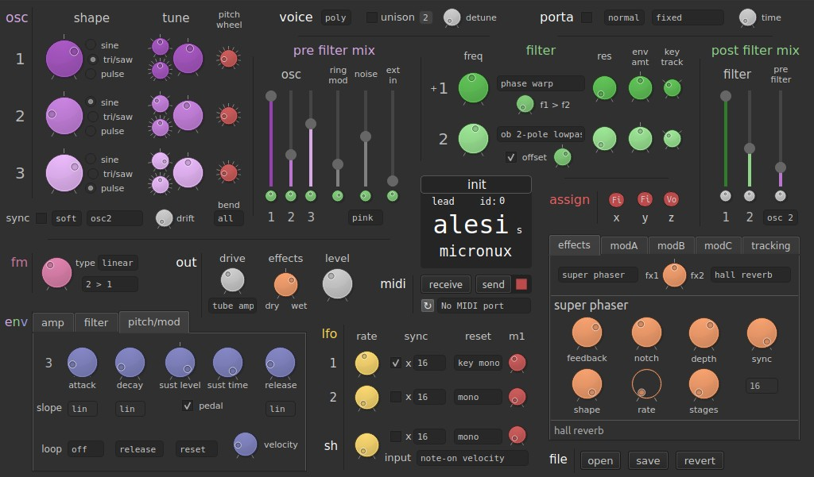

# Micronux

**Micronux** is an editor for Linux to edit programs from the Alesis Micron synthesiser.  
It is just a front end to edit the text files generated by Alesis' program decoder/encoder perl script, and doesn't work in real time (but close).

### Alpha

**Warning:** After receiving a program from the Micron, **save a backup copy** before pressing 'send' or enabling 'auto-send', as these options will **overwrite** the program on the Micron.

### Features

  - Open and save `.syx` or `.txt` Micron program files.

  - Receive and send program sysex messages, selecting from a list of available MIDI ports.

  - Edit *almost* all program settings, including oscillators, envelopes, filters, mixers, effects, modulation routing and tracking generator.

### [To Do List](docs/TODO.md)

### Install

You're gonna need amidi, python3 and PySide2:

    sudo apt install amidi python3-pip
    pip3 install PySide2

Then from the micronux folder:

    python3 ./micronux.py --create-launcher

This will create a `micronux.desktop` launcher file that you can place anywhere. Alternatively, you can just run `./micronux.py` but remember to make it executable first.

### Usage

To receive a sysex, make sure that the right MIDI port is selected and bring up the `Send MIDI sysex?` option on the Micron. In Micronux click `receive` and right after press down the Micron's control knob.

Pressing `send` will overwrite the program with the same name on the Micron and ticking the checkbox next to it enables 'auto-send'. For now, edits on sliders and dials are only updated on mouse release which means that edits done with the mouse wheel or keyboard are not automatically sent.

The `revert` button *should* bring you back to the 'received' state (or saved/open state, whichever came last), but do not rely on it, it might be buggy and needs testing.

### About

*Micronux* is written in **Python 3** and uses the **PySide2** bindings for its **QT** graphical interface, which is built using **QT Designer**. It uses **amidi** to send/receive sysex programs through MIDI.

The user interface is inspired by the physical layout of the Ion synthesiser as well as existing Mac/Windows editors. Since the amount of controls and settings of the Micron can be overwhelming, the goal is to simplify and promote the more commonly used settings.

Additionally, one goal is to keep Micronux functional on a netbook screen, so limited to a size of 1024x600 pixels.
